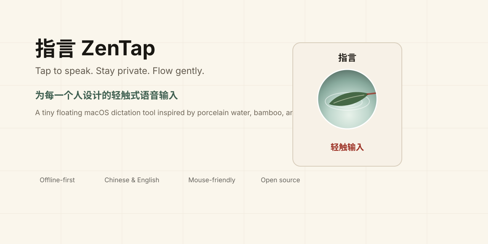

<p align="center">
  
</p>

<p align="center">
  <a href="docs/README.zh-CN.md">中文</a>
  ·
  <a href="docs/README.en.md">English</a>
  ·
  <a href="LICENSE">MIT License</a>
</p>

# 指言 ZenTap

ZenTap is a small open-source macOS dictation tool: click a floating window to start speaking, click again to insert the recognized text.

指言是一款开源的 macOS 轻触式语音输入工具：点击悬浮窗开始说话，再点一次，把识别出的文字输入到当前光标处。

<p align="center">
  
</p>

## Why

Most voice input tools are started by keyboard shortcuts. That is inconvenient for people who cannot easily use a keyboard, and it is also not ideal for anyone who wants a calmer, mouse-first writing flow.

ZenTap begins with accessibility, but it is not only for a specific group. It is for anyone who wants speech input to feel light, private, and human.

## Highlights

- Mouse-first: tap the floating window to start or stop dictation.
- Privacy-first: uses the macOS Speech framework with on-device recognition required.
- Offline-friendly: no network code, no upload path, no server.
- Input-method bridge: optionally use ZenTap as a mouse-click trigger for third-party IME voice shortcuts, such as Doubao IME's `fn` voice shortcut.
- Bilingual: Chinese and English recognition modes.
- Minimal UI: standard mode plus Zen Mode, inspired by porcelain water and a bamboo leaf.
- Open source: built to be studied, improved, localized, and shared.

## Quick Start

1. Download the latest DMG:

   [ZenTap-0.1.1.dmg](https://github.com/Dovesoup/ZenTap/releases/latest/download/ZenTap-0.1.1.dmg)

2. Open the DMG and drag `ZenTap.app` into `Applications`.
3. On first launch, macOS may say the developer cannot be verified because this open-source build is not notarized yet. Right-click `ZenTap.app`, choose **Open**, then confirm.
4. Allow microphone and speech recognition permissions when macOS asks.
5. For automatic text insertion, enable ZenTap in:

   ```text
   System Settings -> Privacy & Security -> Accessibility
   ```

6. Put the cursor in any text field, tap ZenTap, speak, then tap again.

### Doubao IME bridge

ZenTap can also work as a mouse-first bridge for Doubao IME voice input. Right-click ZenTap, choose `输入引擎 -> 豆包快捷键`, and keep `豆包快捷键 -> fn` selected unless you changed Doubao's shortcut. In this mode, the first click sends Doubao's voice shortcut, and the second click sends `Shift` by default to stop Doubao's voice bar without sending a chat message.

If your Doubao setup behaves differently, use `豆包结束方式` to switch the second-click action to `Esc`, `Return`, or repeat the original shortcut. `Return` is kept as an advanced option because some chat apps treat it as Send.

Privacy note: the built-in ZenTap speech mode is on-device only. Doubao bridge mode follows Doubao IME's own recognition and privacy behavior.

<p align="center">
  
</p>

## More

- [中文介绍](docs/README.zh-CN.md)
- [English README](docs/README.en.md)
- [License](LICENSE)
