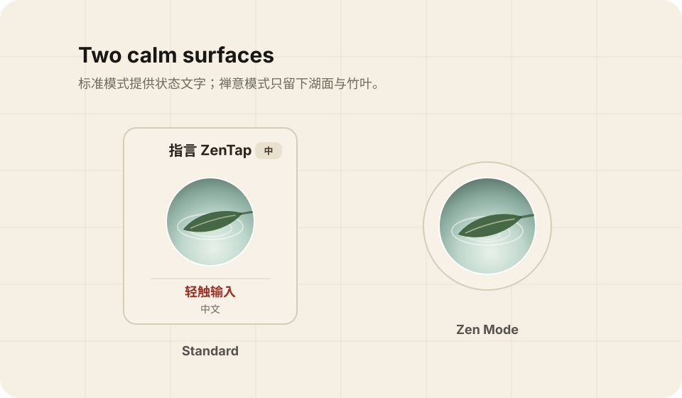
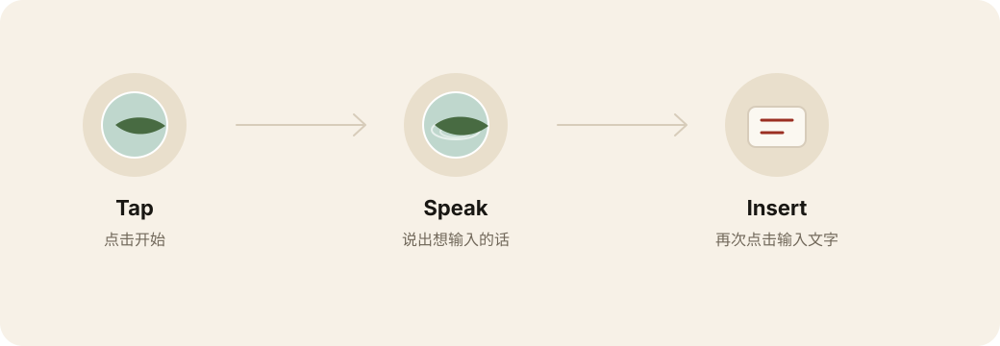

# ZenTap

> Tap to speak. Stay private. Flow gently.

ZenTap is an open-source macOS dictation tool. It lives as a tiny floating window: tap once to start dictation, tap again to stop, and the recognized text is inserted at the current cursor position.

<p align="center">
  
</p>

## Why

Many dictation tools are triggered by keyboard shortcuts. That can be a real barrier for people who cannot comfortably use a keyboard.

ZenTap started from that accessibility need, but it is not only for one group of users. It is also for anyone who wants a calmer, mouse-first writing flow: drafting, messaging, journaling, searching, or capturing a passing thought.

The product idea is simple: a leaf rests on a quiet lake. Tap, speak, and let the words settle.

## Features

- **Mouse-first**: start and stop dictation by clicking the floating window.
- **Privacy-first**: uses the macOS Speech framework and requires on-device recognition.
- **No upload path**: no server, no account system, no network upload code.
- **Input-method bridge**: optionally turn ZenTap into a mouse-click trigger for third-party IME voice shortcuts, such as Doubao IME's `fn` shortcut.
- **Chinese and English**: switch recognition language from the context menu.
- **Zen-inspired UI**: porcelain lake, bamboo leaf, subtle ripples, and an ultra-minimal Zen Mode.
- **Open source**: built to be inspected, improved, localized, and shared.

## How to Use

1. Build and open the app:

   ```bash
   ./build.sh
   open ~/Desktop/ZenTap.app
   ```

2. Allow microphone and speech recognition permissions when macOS asks.
3. To insert text automatically into other apps, enable ZenTap in:

   ```text
   System Settings -> Privacy & Security -> Accessibility
   ```

4. Place the cursor in any text field.
5. Tap ZenTap and speak.
6. Tap ZenTap again. The recognized text will be inserted at the cursor.

## Doubao IME Bridge

If you prefer Doubao IME's speech recognition quality, ZenTap can act only as the mouse-first trigger.

Right-click the ZenTap floating window and choose:

```text
输入引擎 -> 豆包快捷键
豆包快捷键 -> fn
```

Doubao IME currently recommends `fn` as its default voice shortcut. If you change the shortcut inside Doubao, choose the same preset from ZenTap's **豆包快捷键** menu.

In this mode, the first click sends Doubao's voice shortcut. The second click sends `Return` by default to submit and close Doubao's voice bar. If your Doubao version behaves differently, change **豆包结束方式** to `Esc`, `Shift`, or repeat the original shortcut.

Privacy note: ZenTap's built-in speech mode is designed for on-device recognition. In **豆包快捷键** mode, Doubao IME performs the speech recognition, so Doubao's own recognition and privacy behavior applies.

<p align="center">
  
</p>

## Zen Mode

Right-click the floating window and enable **Zen Mode**. The interface becomes a minimal circular surface: just a porcelain lake and a bamboo leaf.

It is designed to sit quietly at the edge of the screen until you need it.

## Privacy

ZenTap is designed to be offline-first, private, and inspectable.

- It uses Apple's Speech framework.
- It sets `requiresOnDeviceRecognition`.
- If on-device recognition resources are unavailable for the selected language, the app should refuse to start dictation rather than silently falling back to a network path.
- There is no server, account system, analytics pipeline, or upload path in this project.

## Current Limitations

- Chinese and English are switched manually for now.
- Offline recognition resources are managed by macOS and may need to be installed by the user.
- The current build script creates a local test app. A public release should use Developer ID signing and notarization.
- During development, rebuilding the app may require re-adding it to Accessibility permissions.

## Build from Source

Requires macOS and Swift command line tools.

```bash
./build.sh
```

The built app is placed at:

```text
~/Desktop/ZenTap.app
```

## Contributing

Contributions are welcome, especially around:

- accessibility workflows
- visual design and motion
- localization
- permission onboarding
- packaging, signing, and release automation
- documentation and tutorials

## License

MIT License
